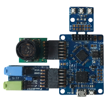

# ICEBreaker FPGA distance detector
This project aims to provide a distance measuring logic using an ICEBreaker FPGA paired with an ultrasonic sensor.
Depending on how far away the object is, a LED is lit up / a tone is generated. Both the ultrasonic sensor as well as the DAC is connected to the board to the PMOD.

## Verilog Code Structure

